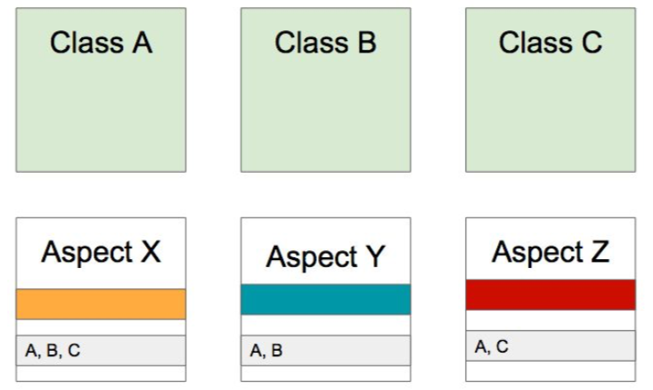

# 스프링 AOP: 개념 소개
> Aspect-oriendted Programming (AOP)은 OOP를 보완하는 수단으로  
> 흩어진 Aspect를 모듈화 할 수 있는 프로그래밍 기법  
> 해야 할 일과 그 일을 어디 어디에 적용 해야 하는 지를 묶어서 모듈화 하는 것  

## 흩어진 관심사 (Crosscutting Concerns)
> concerns 비슷한 기능들  
  

  
## AOP를 적용하면? 
> 흩어진 것들을 한군데 모음  
> Aspect는 각각의 concern별로 Aspect를 만들고 실제 하던일 별로 Aspect 안에 독립적으로 정의  
> 독립적으로 정의된 일을 어디에 적용해야 되는 지 그 정보를 개발자가 입력해줘야 함  
  

  

## AOP 주요 개념
- Aspect: 묶은 모듈 (Advice, PointCut) 포함
- Advice: 해야할 일들
- Pointcut: 어디에 적용해야 하는 지 정보(A, B, C)
  > ex) Class A의 메서드 B 를 호출 할때 Class C의 메서드 foo를 호출할 때만 이 Advice를 적용 하겠다라고 알려주는 것  
- Target: 적용이 되는 대상(Class A, B, C)
- Join Point: 합류 지점, 메서드 실행 시점에 끼어들 수 있는 지점
  > ex) 생성자 호출직전, 생성자 호출이후, 필드에 접근하기전, 필드에서 값을 가져갔을 때 등의 여러가지 합류 지점  

## AOP 구현체
https://en.wikipedia.org/wiki/Aspect-oriented_programming
- 자바
  - AspectJ: AOP의 구현체 스프링에서 연동해서 사용할 수 있는 기능을 제공
  > 다양한 Join Point와 다양한 기능들을 제공  
  - 스프링 AOP: 스프링 자체에서 구현한 기능 이 기능을 기반으로 스프링 트랜잭션이나 캐쉬 다른 기능들이 적용되고 있음
  > 매우 국한 적으로 기능을 제공함  

## AOP 적용 방법
> 모듈화한 concerns 들을 적용하는 방법  
### 컴파일
> Java파일을 Class파일로 만들 때 Byte코드들을 조작을 하면서 조작이된 Byte코드들을 생성해 내는 것  
> 컴파일 시점에 필요한 메서드가 Class에 들어있어야 함  
- 장점: 컴파일 시점에 적용하면 이미 Byte 코드를 만들 때 만들었으므로 로드타임이나 런타임 시에는 아무런 성능적인 부하가 없음
- 단점: 적용하려면 별도의 컴파일 과정을 한번 거쳐야 된다는 문제가 있음
### 로드타임
> A라는 Class는 순수한 Class로 컴파일 하고 Class를 로딩하는 시점에 **로드타임 위빙** 로드 타임에 뭔가를 끼워 넣음  
> A라는 Class의 Byte코드는 그대로 있지만 로딩한 JVM메모리 상에서는 필요한 메서드가 적용되어 로딩이 됨  
- 단점: 클래스 로딩할 때 약간의 부하가 생길 수 있음, **로드타임 위버** Java Agent를 설정 해줘야 함
- 장점: AspectJ를 사용할 수 있으므로 다양한 문법을 사용할 수 있다는 점
### 런타임: 스프링 AOP가 사용하는 방법
> A라는 빈에 Aspect가 가진 메서드를 적용해야 된다는 것을 스프링이 알고 있음 A라는 클래스 타입의 빈을 만들 때(빈을 만드는 과정은 런타임)  
> A라는 빈을 감싼 A라는 타입의 Proxy빈을 만듬 Proxy빈이 실제 A가 가지고 있는  
> 메서드를 호출하기 직전에 Aspect가 가진 메서드를 적용하고 메서드를 호출함  
- 단점: 빈을 만드는 초기에 성능에 약간 부하가 생길 수 있음
- 장점: 별도의 컴파일러나 별도의 Java Agent로 로드타임 위버를 설정한다 던가 하는 설정을 할 필요가 없고 문법이 굉장히 쉬움
  별도의 AOP공부를 많이 할 필요가 없음

## 추천 방법
> 가장 현실 적이고 가장 합리적인 선택은 스프링 AOP가 사용하는 런타임 시 적용하는 방법  
> 경우에 따라 AspectJ가 제공하는 다양한 Join Point들을 사용해야 하는 경우도 있음  
> AspectJ 컴파일러로 컴파일을 하거나 별도의 Java Agent를 설정해서 로드타임 위빙을 하는 방법으로  
> AspectJ와 연동을 해서 사용을 할 수 있음  