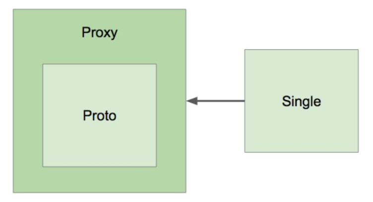

# IoC 컨테이너 5부: 빈의 스코프
## 스코프
> 스프링에서는 기본적으로 싱글톤 스코프를 사용함
> 싱글톤 스코프는 애플리케이션을 초기에 구동할때 ApplicationContext를 만들때 만드므로 시간이 좀 걸림
- 싱글톤 : 해당 빈의 인스턴스가 오직 한개 뿐임
- 프로토타입 : 매번 새로운 객체를 만들어서 사용해야되는 스코프
  - Request
  - Session
  - WebSocket 
  - ...

### 프로토타입 빈이 싱글톤 빈을 참조하면? 
> 아무 문제 없음

### 싱글톤 빈이 프로토타입 빈을 참조하면?
- 프로토타입 빈이 업데이트가 안되네?
- 업데이트 하려면
  - scoped-proxy
  - Object-Provider
  - Provider (표준)

### 프로토타입으로 적용해야될 경우
> 그냥 호출하면 싱글톤으로 호출하게 되므로 프록시로 감싸서 매번 새로운 객체가 만들어지도록 함
> 매번 바꿔줄 수 있는 Proxy로 감싸도록 아래와 같이 설정하면 됨
> CG라이브러리라는 써드파트 라이브러리가 CLASS도 Proxy로 만들 수 있게 해줌
> Java JDK 안에 있는 라이브러리는 인터페이스만 Proxy로 만들 수 있음
> 프록시 인스턴스가 만들어지고 프록시 빈을 의존성으로 주입함
```java
@Component @Scope(value="prototype" , proxyMode = ScopedProxyMode.TARGET_CLASS)
public class Proto {

}
```

> 넓은 생명주기의 싱글톤 스코프에서 짧은 생명 주기를 가진 스코프를 주입받아야 할 때는 위와 같이 설정하여 사용

### ObjectProvider 로 지정하는 방법
> ObjectProvider<T> 로 지정하여 도됨 추천하지는 않음
> 빈 설정하는 부분에만 설정하여 깔끔하게 코딩하는 것을 추천
```java
@Component
public class Single {

    @Autowired
    private ObjectProvider<Proto> proto;

    public Proto getProto() {
        return proto.getIfAvailable();
    }
}
```

## 프록시 
​https://en.wikipedia.org/wiki/Proxy_pattern​


## 싱글톤 객체 사용시 주의할 점
- 프로퍼티가 공유: 여기저기서 사용하면서 값을 바꾸면 그 값이 공유되어 위험하므로 쓰레드 세이프한 방법으로 사용해야 함
- ApplicationContext 초기 구동시 인스턴스 생성되므로 구동하면서 시간이 좀 걸림