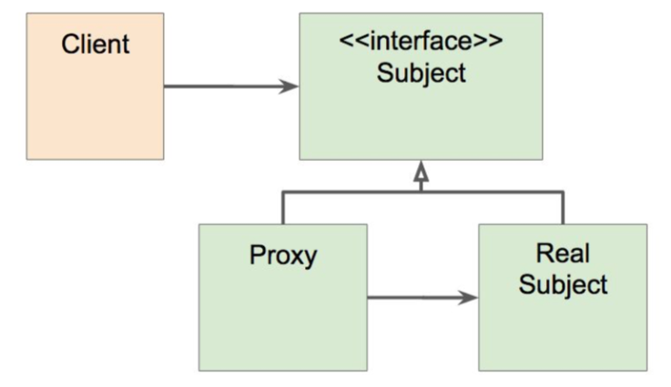

# 스프링 AOP: 프록시 기반 AOP
## 스프링 AOP 특징
- **프록시 기반의 AOP** 구현체
- **스프링 빈에만 AOP를 적용**할 수 있다
- 모든 AOP 기능을 제공하는 것이 목적이 아니라, 스프링 IoC와 연동하여 엔터프라이즈
  애플리케이션에서 가장 흔한 문제에 대한 해결책을 제공하는 것이 목적

## 프록시 패턴
- 왜?(기존 코드 변경없이) 접근 제어 또는 부가 기능 추가
> Proxy패턴은 Interface(Subject)가 있고 Client는 Interface 타입으로 Proxy객체를 사용하게 됨
> Proxy객체는 Target(Real Subject)객체를 참조하고 있음
> Proxy객체가 Traget객체를 감싸서 실제 Client의 요청을 처리함
  

  

- 기존 코드를 건드리지 않고 성능을 측정해 보자. (프록시 패턴으로)

## 문제점
- 매번 프록시 클래스를 작성해야 하는가?
- 여러 클래스 여러 메소드에 적용하려면?
- 객체들 관계도 복잡하고...

## 그래서 등장한 것이 스프링 AOP
- 스프링 IoC 컨테이너가 제공하는 기반 시설과 Dynamic 프록시를 사용하여 여러
  복잡한 문제 해결
- 동적 프록시: 동적으로 프록시 객체 생성하는 방법
  - 자바가 제공하는 방법은 인터페이스 기반 프록시 생성
  - CGlib은 클래스 기반 프록시도 지원
- 스프링 IoC: 기존 빈을 대체하는 동적 프록시 빈을 만들어 등록 시켜준다
  - 클라이언트 코드 변경 없음
  - [AbstractAutoProxyCreator​](https://docs.spring.io/spring/docs/current/javadoc-api/org/springframework/aop/framework/autoproxy/AbstractAutoProxyCreator.html) implements ​[BeanPostProcessor](https://docs.spring.io/spring/docs/current/javadoc-api/org/springframework/beans/factory/config/BeanPostProcessor.html)