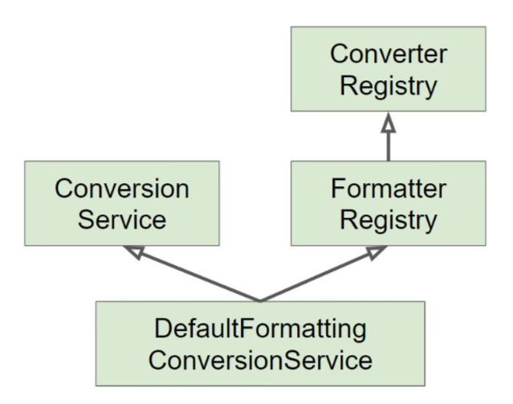

# 데이터 바인딩 추상화: Converter와 Formatter
> 스프링이 기본적으로 자동으로 Converting 해주지 않는 것만 만들면 됨    
> 추천은 Formatter를 사용하는 것을 추천함  

## Converter
https://docs.spring.io/spring-framework/docs/current/javadoc-api/org/springframework/core/convert/converter/Converter.html
> PropertyEditor 대신에 사용할 수 있는 기능 중에 하나  
> 상태 정보가 없으므로 얼마 든지 빈으로 등록해서 사용해도 상관은 없음  
- S타입을 T타입으로 변환할 수 있는 매우 일반적인 변환기
- 상태 정보 없음 == Stateless == 쓰레드세이프
```java
public class EventConverter {

    public static class StringToEventConverter implements Converter<String, Event> {

        @Override
        public Event convert(String source) {
            return new Event(Integer.parseInt(source));
        }
    }

    public static class EventToStringConverter implements Converter<Event, String> {
        @Override
        public String convert(Event source) {
            return source.getId().toString();
        }
    }
}
```

### ConverterResistry
https://docs.spring.io/spring-framework/docs/current/javadoc-api/org/springframework/core/convert/converter/ConverterRegistry.html
> ConverterRegistry​에 등록해서 사용  
> 아래와 같이 설정하면 스프링MVC설정에 넣어준 Converter가 모든 컨트롤러에서 동작함  
```java
@Configuration
public class WebConfig implements WebMvcConfigurer {

    @Override
    public void addFormatters(FormatterRegistry registry) {
        registry.addConverter(new EventConverter.StringToEventConverter());
    }
}
```

## Formatter
https://docs.spring.io/spring-framework/docs/current/javadoc-api/org/springframework/format/Formatter.html
- PropertyEditor 대체제
- Object와 String 간의 변환을 담당한다
- 문자열을 Locale에 따라 다국화하는 기능도 제공한다 (optional)
```java
public class EventConverter {

    public static class StringToEventConverter implements Converter<String, Event> {

        @Override
        public Event convert(String source) {
            return new Event(Integer.parseInt(source));
        }
    }

    public static class EventToStringConverter implements Converter<Event, String> {
        @Override
        public String convert(Event source) {
            return source.getId().toString();
        }
    }
}
```

### FormatterRegistry
- FormatterRegistry​에 등록해서 사용
https://docs.spring.io/spring-framework/docs/current/javadoc-api/org/springframework/format/FormatterRegistry.html
```java
@Configuration
public class WebConfig implements WebMvcConfigurer {

    @Override
    public void addFormatters(FormatterRegistry registry) {
        // registry.addConverter(new EventConverter.StringToEventConverter());
        registry.addFormatter(new EventFormatter());
    }
}
```

## ConversionService
> DataBinder대신에 Converter와 Formatter을 활용할 수 있게 해줌  
> 인터페이스를 통해서 등록되는 Converter와 Formatter들은 ConversionService에 등록이 되고  
> ConversionService를 통해서 실제 변환하는 작업을 함  
- 실제 변환 작업은 이 인터페이스를 통해서 쓰레드-세이프하게 사용할 수 있음
- 스프링 MVC​​, 빈 (value) 설정, SpEL에서 사용한다
- DefaultFormattingConversionService
  > 자주 사용하게 되는 클래스  
  - FormatterRegistry
  - ConversionService
  - 여러 기본 Converter와 Formatter를 등록 해줌



## 스프링 부트
- 웹 애플리케이션인 경우에 DefaultFormattingConversionSerivce를 상속하여 만든 
  WebConversionService​​를 빈으로 등록해 준다(더 많은 기능들이 포함)
- Formatter와 Converter 빈을 찾아 자동으로 등록해 준다

### Converter
> 빈으로 등록하면 WebConversionService​​가 빈을 찾아 자동으로 등록  
```java
public class EventConverter {

    @Component
    public static class StringToEventConverter implements Converter<String, Event> {

        @Override
        public Event convert(String source) {
            return new Event(Integer.parseInt(source));
        }
    }

    @Component
    public static class EventToStringConverter implements Converter<Event, String> {
        @Override
        public String convert(Event source) {
            return source.getId().toString();
        }
    }
}
```

### Formatter
> 빈으로 등록하면 WebConversionService​​가 빈을 찾아 자동으로 등록  
```java
@Component
public class EventFormatter implements Formatter<Event> {
    @Override
    public Event parse(String text, Locale locale) throws ParseException {
        return new Event(Integer.parseInt(text));
    }

    @Override
    public String print(Event object, Locale locale) {
        return object.getId().toString();
    }
}
```

### 테스트
> @WebMvcTest는 슬라이싱 테스트  
> 웹과 관련된 빈만 등록해주는 계층형 테스트라서 컨트롤러들만 주로 등록이 됨  
> Formatter나 Converter가 빈으로 등록이 안되면 테스트가 깨질 우려가 있음  
> @WebMvcTest 안에 등록해주면 빈으로 등록이 됨  
> 그냥 클래스만 등록해주면 안되고 @Controller나 @Component가 있어야 빈으로 등록이 됨  
```java

@RunWith(SpringRunner.class)
// @WebMvcTest({EventFormatter.class, EventController.class})
@WebMvcTest({EventConverter.StringToEventConverter.class, EventController.class})
public class EventControllerTest {

    @Autowired
    MockMvc mockMvc;

    @Test
    public void getTest() throws Exception {
        mockMvc.perform(get("/event/1"))
                .andExpect(status().isOk())
                .andExpect(content().string("1"))
        ;
    }
}
```

## 기본적으로 등록된 Converter들을 보는 방법
```java
@Component
public class AppRunner implements ApplicationRunner {

    @Autowired
    ConversionService conversionService;

    @Override
    public void run(ApplicationArguments args) throws Exception {
        System.out.println(conversionService);
        System.out.println(conversionService.getClass().toString());
    }
}
```